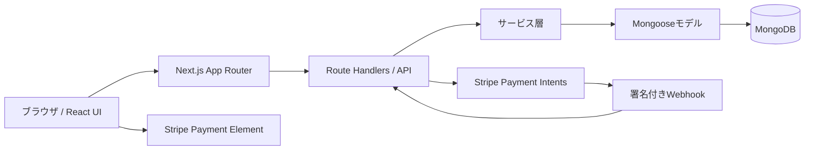
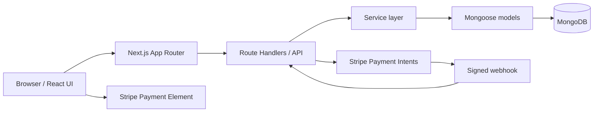

# EC Site

[](https://github.com/Empyrean1026/EC-SHOP/actions/workflows/ci.yml)

A full-stack e-commerce web application built with Next.js, TypeScript, MongoDB, and Stripe.

Next.js、TypeScript、MongoDB、Stripeを使用して開発したフルスタックECサイトです。

**Language:** [日本語](#日本語) | [English](#english)

**Repository:** [github.com/Empyrean1026/EC-SHOP](https://github.com/Empyrean1026/EC-SHOP)

**Demo:** 公開デモは現在ありません。ローカル環境またはDockerで実行できます。 / A public demo is not currently deployed. Run the application locally or with Docker.

---

## 日本語

### 概要

EC Siteは、Next.js App Routerで構築したレスポンシブ対応のフルスタックECアプリケーションです。商品検索からカート、購入手続き、Stripe決済、注文管理までの購入体験に加え、マイページと管理画面を一つのリポジトリで提供します。

金額は日本円、日付は`ja-JP`形式で表示します。決済結果はブラウザからの戻り値だけに依存せず、Stripeの署名付きWebhookを検証して注文へ反映します。

### Demo

公開環境へのデプロイはまだ行っていません。動作確認は[セットアップ](#セットアップ)または[Docker](#docker)の手順で行えます。

### 主な機能

- **認証:** 新規登録、ログイン、ログアウト、HttpOnly Cookieに保存するJWT、ロールベースアクセス制御
- **商品:** 商品一覧、商品詳細、カテゴリー、絞り込み、並び替え、ページネーション、在庫表示
- **検索:** MongoDB全文検索、検索候補、あいまい検索のフォールバック、ブラウザ内の検索履歴
- **カート:** ゲスト用ローカルカート、数量変更、在庫制限、ログイン後のMongoDB同期
- **お気に入り:** 商品の追加・削除とマイページでの一覧表示
- **購入手続き:** お届け先入力、入力検証、注文内容確認、注文作成
- **決済:** Stripe Payment Element、Payment Intent、署名付きWebhookによる支払い確定
- **注文:** 注文履歴、注文詳細、支払い状況、配送状況
- **マイページ:** プロフィール、既定のお届け先、注文履歴、お気に入り
- **管理画面:** 商品・在庫・注文・ユーザーの管理、注文状況の更新
- **分析:** 総売上、注文数、ユーザー数、商品数、人気商品、日次・月次売上
- **UI / UX:** PC・タブレット・モバイル対応、ダークモード、スケルトン、Toast、Modal、空・成功・エラー状態
- **セキュリティ:** Zod入力検証、bcrypt、CSRF対策、CSPなどのセキュリティヘッダー、APIレート制限
- **運用:** Docker Compose、データ投入・index作成スクリプト、自動テスト

### 技術スタック

| 分類               | 技術                                                       |
| ------------------ | ---------------------------------------------------------- |
| フロントエンド     | Next.js 16、React 19、TypeScript、App Router               |
| UI                 | Tailwind CSS 4、React Hook Form、Recharts                  |
| 状態管理           | Zustand                                                    |
| API                | Next.js Route Handlers                                     |
| データベース       | MongoDB 8、Mongoose 9                                      |
| 認証・セキュリティ | JWT（jose）、bcrypt、Zod、HttpOnly Cookie、CSRF            |
| 決済               | Stripe Payment Element、Payment Intent、Webhook            |
| テスト・品質       | ESLint、Prettier、Node.js Test Runner、Vitest、Playwright  |
| 実行・配布         | Node.js、Docker、Docker Compose、Next.js standalone output |

### システム構成



主なディレクトリは次のとおりです。

```text
app/             画面、レイアウト、Route Handlers
components/      UIと機能別コンポーネント
e2e/             Playwright E2E/APIテスト
hooks/           React hooks
lib/             認証、検証、API、共通処理
models/          Mongooseモデルとスキーマ
public/products/ ローカル商品画像
scripts/         seed、index、migration、運用スクリプト
services/        サーバー・クライアントサービス
store/           Zustandストア
tests/           Node.jsテスト
tests-vitest/    Vitestテスト
types/           共有TypeScript型
```

機能別の設計・実装メモは[docs/README.md](docs/README.md)から参照できます。

主な画面:

- `/products` — 商品一覧
- `/search` — 商品検索
- `/cart` — カート
- `/checkout` — 購入手続き
- `/account` — マイページ
- `/account/orders` — 注文履歴
- `/account/address` — お届け先管理
- `/account/wishlist` — お気に入り
- `/admin` — 管理画面
- `/admin/analytics` — 売上分析

### セットアップ

必要環境:

- Node.js 20.19以上（`.nvmrc`ではNode.js 22を指定）
- npm
- MongoDB 8、またはDocker Desktop
- StripeテストアカウントとStripe CLI（決済を検証する場合）

```bash
git clone https://github.com/Empyrean1026/EC-SHOP.git
cd EC-SHOP
npm ci
cp .env.example .env.local
```

`.env.local`へ必要な値を設定したあと、環境変数を検証し、MongoDBのindexとサンプルデータを準備します。

```bash
npm run env:check
npm run db:indexes
npm run db:seed
```

サンプルの商品・カテゴリーは`scripts/catalog-seed-data.ts`で管理しています。商品画像は`public/products/`に保存した、文字・ロゴ・ブランド要素を含まないローカルSVGです。`npm run db:seed`はslug単位で商品を更新するため、再実行できます。

管理画面を確認する場合は、ユーザー登録後に次のコマンドを実行し、再ログインしてください。

```bash
npm run user:role -- --email=user@example.com --role=admin
```

### 環境変数

`.env.example`をコピーし、実際の値は`.env.local`またはデプロイ先のSecret管理機能に設定してください。秘密情報をGitへコミットしないでください。

| 変数                                 | 用途                                                 |
| ------------------------------------ | ---------------------------------------------------- |
| `MONGODB_URI`                        | MongoDB接続URI                                       |
| `APP_URL`                            | アプリケーションのURL                                |
| `JWT_SECRET`                         | JWT署名用シークレット（32バイト以上）                |
| `CSRF_SECRET`                        | CSRFトークン用シークレット（32バイト以上）           |
| `BCRYPT_SALT_ROUNDS`                 | bcryptのコスト（10〜14）                             |
| `TRUST_PROXY`                        | 信頼できるリバースプロキシ配下でのみ`true`           |
| `STRIPE_SECRET_KEY`                  | Stripeテストモードのシークレットキー                 |
| `NEXT_PUBLIC_STRIPE_PUBLISHABLE_KEY` | Stripeテストモードの公開可能キー                     |
| `STRIPE_WEBHOOK_SECRET`              | Stripe Webhook署名シークレット                       |
| `DEEPSEEK_API_KEY`                   | AI商品提案に使用するサーバー専用APIキー              |
| `DEEPSEEK_BASE_URL`                  | DeepSeek API URL（既定: `https://api.deepseek.com`） |
| `DEEPSEEK_MODEL`                     | DeepSeekモデル（既定: `deepseek-v4-flash`）          |

Stripe関連の3変数は、すべて設定するか、すべて未設定にしてください。従来の`AUTH_SECRET`も読み取り可能ですが、新しい環境では`JWT_SECRET`を使用します。

### 起動方法

開発サーバー:

```bash
npm run dev
```

[http://localhost:3000](http://localhost:3000)を開きます。`npm`コマンドは`package.json`があるプロジェクトルートで実行してください。

ローカルで本番ビルドを起動する場合:

```bash
npm run build
npm start
```

### テスト

```bash
npm run lint
npm run typecheck
npm test
npm run test:api
npm run test:e2e
npm run build
```

`npm run check`は、環境変数、フォーマット、lint、型チェック、Node.js/Vitestテストをまとめて実行します。Playwrightを初めて実行する前に、ブラウザをインストールしてください。

```bash
npx playwright install chromium
npm run check
```

テスト対象には、登録、ログイン、商品API、カート、購入手続き、Stripe連携、注文処理が含まれます。Stripeの実通信を伴う決済閉ループは、次節のテストモード手順で確認します。

### Stripe

このプロジェクトはPayment Intentを作成し、Stripe Payment Elementで支払いを受け付けます。注文の支払い済み状態は、`payment_intent.succeeded` Webhookの署名検証後に更新します。フロントエンドのリダイレクトだけを支払い証明として使用しません。

Stripe CLIでローカルWebhookを転送します。

```bash
stripe login
stripe listen --forward-to localhost:3000/api/webhooks/stripe
```

表示された`whsec_...`を`STRIPE_WEBHOOK_SECRET`へ設定し、開発サーバーを再起動します。Stripeテストモードでは、カード番号`4242 4242 4242 4242`、任意の将来日、有効なCVCを使用できます。

### Docker

アプリケーションとMongoDBを起動し、サンプルデータを投入します。

```bash
docker compose up -d --build
docker compose run --rm db-init npm run db:seed
docker compose ps
```

停止:

```bash
docker compose down
```

MongoDBボリュームも意図的に削除する場合のみ、`docker compose down -v`を使用してください。

### スクリーンショット

公開用スクリーンショットは現在リポジトリに含まれていません。追加時の保存場所と安全確認項目は[docs/screenshots/README.md](docs/screenshots/README.md)にまとめています。

### 今後の改善

以下は現在未実装の改善候補です。

- 公開デモ環境と継続的デプロイの整備
- 公開用スクリーンショットと操作デモの追加
- 決済と在庫更新をまたぐ、より厳密な在庫引当処理
- Stripe返金処理の管理画面への統合
- 本番環境向けの集中ログ、監視、アラート

### License

このリポジトリは公開閲覧できますが、オープンソースではありません。[LICENSE](LICENSE)に記載のとおり、著作権者による事前の書面許可がない限り、すべての権利を留保します。

セキュリティ上の問題は、公開Issueに機密情報を掲載せず、[SECURITY.md](SECURITY.md)の手順で報告してください。コントリビューション手順は[CONTRIBUTING.md](CONTRIBUTING.md)を参照してください。

---

## English

### Overview

EC Site is a responsive full-stack e-commerce application built with the Next.js App Router. It provides the customer journey from product discovery through cart, checkout, Stripe payment, and order management, together with account and administration areas in one repository.

Prices are displayed in Japanese yen and dates use the `ja-JP` locale. Payment results are not trusted from the browser alone: signed Stripe webhooks are verified before an order is marked as paid.

### Demo

A public deployment is not currently available. Use the [Setup](#setup) or [Docker](#docker-1) instructions to run the application.

### Features

- **Authentication:** Registration, login, logout, JWT in an HttpOnly cookie, and role-based access control
- **Products:** Catalog, product details, categories, filters, sorting, pagination, and stock display
- **Search:** MongoDB full-text search, suggestions, fuzzy fallback, and browser-local search history
- **Cart:** Local guest cart, quantity updates, stock limits, and MongoDB synchronization after login
- **Wishlist:** Add and remove products and view saved items in the account area
- **Checkout:** Shipping address form, validation, order review, and order creation
- **Payments:** Stripe Payment Element, Payment Intents, and payment confirmation through signed webhooks
- **Orders:** Order history, order details, payment status, and fulfillment status
- **Account:** Profile, default shipping address, order history, and wishlist
- **Administration:** Product, inventory, order, and user management with order-status updates
- **Analytics:** Total sales, order/user/product counts, top products, and daily/monthly sales
- **UI / UX:** Responsive desktop, tablet, and mobile layouts; dark mode; skeletons; toasts; modals; and empty, success, and error states
- **Security:** Zod validation, bcrypt, CSRF protection, CSP and other security headers, and API rate limiting
- **Operations:** Docker Compose, seed/index scripts, and automated tests

### Tech Stack

| Area               | Technology                                                 |
| ------------------ | ---------------------------------------------------------- |
| Frontend           | Next.js 16, React 19, TypeScript, App Router               |
| UI                 | Tailwind CSS 4, React Hook Form, Recharts                  |
| State              | Zustand                                                    |
| API                | Next.js Route Handlers                                     |
| Database           | MongoDB 8, Mongoose 9                                      |
| Auth / Security    | JWT (jose), bcrypt, Zod, HttpOnly cookies, CSRF            |
| Payments           | Stripe Payment Element, Payment Intents, webhooks          |
| Testing / Quality  | ESLint, Prettier, Node.js Test Runner, Vitest, Playwright  |
| Runtime / Delivery | Node.js, Docker, Docker Compose, Next.js standalone output |

### Architecture



Project layout:

```text
app/             Pages, layouts, and Route Handlers
components/      UI and feature components
e2e/             Playwright browser and API tests
hooks/           React hooks
lib/             Authentication, validation, API, and shared logic
models/          Mongoose models and schemas
public/products/ Local product assets
scripts/         Seed, index, migration, and operational scripts
services/        Server and client services
store/           Zustand stores
tests/           Node.js tests
tests-vitest/    Vitest tests
types/           Shared TypeScript types
```

See [docs/README.md](docs/README.md) for feature-specific design and implementation notes.

Main routes:

- `/products` — Product catalog
- `/search` — Product search
- `/cart` — Cart
- `/checkout` — Checkout
- `/account` — Account dashboard
- `/account/orders` — Order history
- `/account/address` — Shipping address management
- `/account/wishlist` — Wishlist
- `/admin` — Administration dashboard
- `/admin/analytics` — Sales analytics

### Setup

Requirements:

- Node.js 20.19 or newer (`.nvmrc` selects Node.js 22)
- npm
- MongoDB 8 or Docker Desktop
- A Stripe test account and Stripe CLI when verifying payments

```bash
git clone https://github.com/Empyrean1026/EC-SHOP.git
cd EC-SHOP
npm ci
cp .env.example .env.local
```

After setting the required values in `.env.local`, validate the environment and prepare MongoDB indexes and sample data.

```bash
npm run env:check
npm run db:indexes
npm run db:seed
```

Sample products and categories are maintained in `scripts/catalog-seed-data.ts`. Product images are text-free, logo-free, brand-free local SVG files under `public/products/`. The seed command updates products by slug and can be run again safely.

To access the administration area, register an account, run the following command, and then sign in again:

```bash
npm run user:role -- --email=user@example.com --role=admin
```

### Environment Variables

Copy `.env.example`, then store real values in `.env.local` or the deployment platform's secret manager. Never commit secrets to Git.

| Variable                             | Purpose                                                     |
| ------------------------------------ | ----------------------------------------------------------- |
| `MONGODB_URI`                        | MongoDB connection URI                                      |
| `APP_URL`                            | Application URL                                             |
| `JWT_SECRET`                         | JWT signing secret (at least 32 bytes)                      |
| `CSRF_SECRET`                        | CSRF token secret (at least 32 bytes)                       |
| `BCRYPT_SALT_ROUNDS`                 | bcrypt cost factor (10–14)                                  |
| `TRUST_PROXY`                        | Set to `true` only behind a trusted reverse proxy           |
| `STRIPE_SECRET_KEY`                  | Stripe test-mode secret key                                 |
| `NEXT_PUBLIC_STRIPE_PUBLISHABLE_KEY` | Stripe test-mode publishable key                            |
| `STRIPE_WEBHOOK_SECRET`              | Stripe webhook signing secret                               |
| `DEEPSEEK_API_KEY`                   | Server-only API key for grounded AI product recommendations |
| `DEEPSEEK_BASE_URL`                  | DeepSeek API URL (default: `https://api.deepseek.com`)      |
| `DEEPSEEK_MODEL`                     | DeepSeek model (default: `deepseek-v4-flash`)               |

Configure all three Stripe variables together, or leave all three unset. The legacy `AUTH_SECRET` name remains readable, but new environments should use `JWT_SECRET`.

### Running Locally

Development server:

```bash
npm run dev
```

Open [http://localhost:3000](http://localhost:3000). Run `npm` commands from the project root that contains `package.json`.

To run the local production build:

```bash
npm run build
npm start
```

### Testing

```bash
npm run lint
npm run typecheck
npm test
npm run test:api
npm run test:e2e
npm run build
```

`npm run check` runs environment validation, formatting, lint, type checks, and the Node.js/Vitest suites. Install the Playwright browser before its first run:

```bash
npx playwright install chromium
npm run check
```

The test suites cover registration, login, product APIs, cart behavior, checkout, Stripe integration, and order processing. Use the test-mode flow below for an end-to-end payment check against Stripe.

### Stripe

The application creates a Payment Intent and collects payment through Stripe Payment Element. An order becomes paid only after the signed `payment_intent.succeeded` webhook is verified. A frontend redirect is never treated as proof of payment.

Forward local webhooks with Stripe CLI:

```bash
stripe login
stripe listen --forward-to localhost:3000/api/webhooks/stripe
```

Set the displayed `whsec_...` value as `STRIPE_WEBHOOK_SECRET`, then restart the development server. In Stripe test mode, use card number `4242 4242 4242 4242`, any future expiry date, and any valid CVC.

### Docker

Start the application and MongoDB, then load the sample catalog:

```bash
docker compose up -d --build
docker compose run --rm db-init npm run db:seed
docker compose ps
```

Stop the stack:

```bash
docker compose down
```

Use `docker compose down -v` only when you intentionally want to remove the MongoDB volume as well.

### Screenshots

Release screenshots are not currently included. See [docs/screenshots/README.md](docs/screenshots/README.md) for the intended location, naming convention, and safety checklist.

### Future Improvements

The following items are not currently implemented:

- A public demo environment and continuous deployment
- Release-ready screenshots and an interaction demo
- Stricter inventory reservation across payment and stock updates
- Stripe refund handling in the administration area
- Centralized production logging, monitoring, and alerting

### License

This repository is publicly viewable but is not open source. As stated in [LICENSE](LICENSE), all rights are reserved unless the copyright holder grants prior written permission.

Do not disclose sensitive information in a public issue. Follow [SECURITY.md](SECURITY.md) to report security concerns and [CONTRIBUTING.md](CONTRIBUTING.md) for the contribution workflow.
