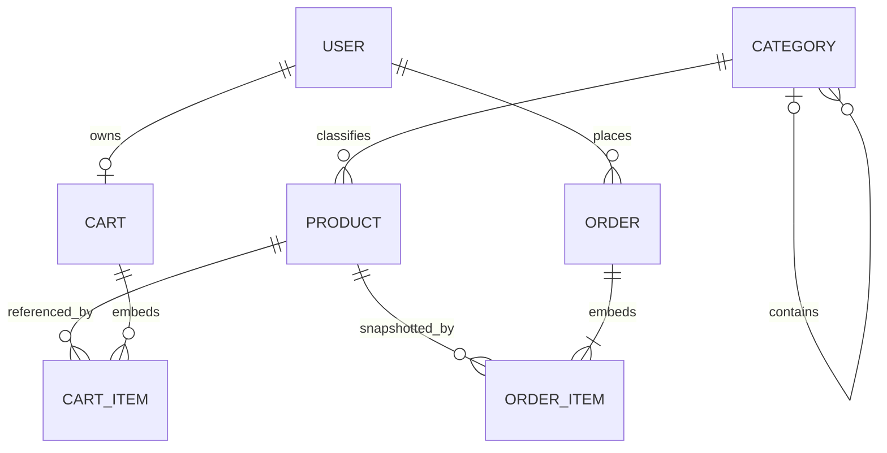

# Database design

This document records the phase-two MongoDB design. The schemas are implemented with Mongoose and use MongoDB `ObjectId` references between top-level collections. Cart items, order items, and addresses are embedded because their lifecycle belongs to the parent document.

## Relationships

`CART_ITEM` and `ORDER_ITEM` are embedded subdocuments rather than MongoDB collections.

## Shared conventions

- MongoDB `_id` is the canonical identifier. JSON responses expose it as a string `id` and remove `_id` and `__v`.
- All top-level schemas use `timestamps: true`, providing `createdAt` and `updatedAt`.
- Money is stored as a non-negative safe integer in the currency's smallest unit. Floating-point values are rejected.
- Supported initial currencies are `jpy`, `usd`, and `cny`; the default is `jpy`.
- URL fields accept only `http` and `https` URLs.
- `passwordHash` is excluded from queries by default and removed during JSON serialization.

## Collections

### users

| Field                    | Type     | Rules                                          |
| ------------------------ | -------- | ---------------------------------------------- |
| `_id`                    | ObjectId | Generated by MongoDB                           |
| `name`                   | string   | Required, trimmed, 2–100 characters            |
| `email`                  | string   | Required, lowercased, unique                   |
| `passwordHash`           | string   | Required, hidden by default, 60–255 characters |
| `role`                   | string   | `customer` or `admin`; defaults to `customer`  |
| `avatar`                 | string   | Optional HTTP(S) URL                           |
| `address`                | Address  | Optional default address                       |
| `createdAt`, `updatedAt` | Date     | Managed by Mongoose                            |

The email unique index prevents duplicate identities. Application code must still translate duplicate-key error `11000` into a safe conflict response because `unique` is an index, not a Mongoose validator.

### categories

| Field                    | Type     | Rules                                 |
| ------------------------ | -------- | ------------------------------------- |
| `_id`                    | ObjectId | Generated by MongoDB                  |
| `name`                   | string   | Required, 2–100 characters            |
| `slug`                   | string   | Required, lowercase, URL-safe, unique |
| `description`            | string   | Optional, up to 1,000 characters      |
| `image`                  | string   | Optional HTTP(S) URL                  |
| `parentCategory`         | ObjectId | Optional self-reference               |
| `isActive`               | boolean  | Defaults to `true`                    |
| `createdAt`, `updatedAt` | Date     | Managed by Mongoose                   |

The service layer must prevent circular parent relationships. Categories referenced by products should be deactivated rather than hard-deleted.

### products

| Field                    | Type     | Rules                                             |
| ------------------------ | -------- | ------------------------------------------------- |
| `_id`                    | ObjectId | Generated by MongoDB                              |
| `name`                   | string   | Required, 2–200 characters                        |
| `slug`                   | string   | Required, lowercase, URL-safe, unique             |
| `description`            | string   | Required, 10–10,000 characters                    |
| `price`                  | integer  | Required, smallest currency unit, zero or greater |
| `currency`               | string   | Supported currency code; defaults to `jpy`        |
| `category`               | ObjectId | Required reference to `categories`                |
| `images`                 | string[] | Up to 12 HTTP(S) URLs                             |
| `stock`                  | integer  | Zero or greater                                   |
| `rating`                 | number   | Between 0 and 5                                   |
| `reviewCount`            | integer  | Zero or greater                                   |
| `isActive`               | boolean  | Defaults to `true`                                |
| `createdAt`, `updatedAt` | Date     | Managed by Mongoose                               |

Products should be deactivated instead of deleted when referenced by existing orders.

### orders

| Field                    | Type        | Rules                                      |
| ------------------------ | ----------- | ------------------------------------------ |
| `_id`                    | ObjectId    | Generated by MongoDB                       |
| `userId`                 | ObjectId    | Required reference to `users`              |
| `items`                  | OrderItem[] | Required, 1–100 embedded snapshots         |
| `totalAmount`            | integer     | Required, smallest currency unit           |
| `currency`               | string      | Supported currency code; defaults to `jpy` |
| `paymentStatus`          | string      | Payment lifecycle enum                     |
| `orderStatus`            | string      | Fulfillment lifecycle enum                 |
| `shippingAddress`        | Address     | Required checkout-time snapshot            |
| `stripePaymentIntentId`  | string      | Optional, sparse unique index              |
| `createdAt`, `updatedAt` | Date        | Managed by Mongoose                        |

Each order item stores `productId`, `name`, `image`, `unitPrice`, `quantity`, and a derived `subtotal`. Product names, images, prices, and addresses are snapshots so later catalog or profile edits cannot rewrite order history.

Payment statuses are `pending`, `processing`, `paid`, `failed`, `partially_refunded`, and `refunded`. Order statuses are `pending`, `confirmed`, `processing`, `shipped`, `delivered`, and `cancelled`. Allowed transitions will be enforced in the order service rather than in the persistence schema.

### carts

| Field                    | Type       | Rules                                 |
| ------------------------ | ---------- | ------------------------------------- |
| `_id`                    | ObjectId   | Generated by MongoDB                  |
| `userId`                 | ObjectId   | Required, unique reference to `users` |
| `items`                  | CartItem[] | Up to 100 distinct products           |
| `createdAt`, `updatedAt` | Date       | Managed by Mongoose                   |

Each cart item stores `productId`, integer `quantity` from 1 to 99, and `addedAt`. The schema rejects duplicate products; quantity changes should update the existing item.

## Indexes

| Collection | Index                                 | Purpose                           |
| ---------- | ------------------------------------- | --------------------------------- |
| users      | `email` unique                        | Login and identity uniqueness     |
| users      | `role, createdAt`                     | Admin user lists                  |
| categories | `slug` unique                         | Category routes                   |
| categories | `parentCategory, isActive, name`      | Category navigation               |
| products   | `slug` unique                         | Product detail routes             |
| products   | text `name, description`              | Product search                    |
| products   | `category, isActive, createdAt`       | New products by category          |
| products   | `category, isActive, price`           | Price sorting/filtering           |
| products   | `isActive, createdAt`                 | Catalog browse                    |
| orders     | `stripePaymentIntentId` sparse unique | Stripe webhook lookup/idempotency |
| orders     | `userId, createdAt`                   | User order history                |
| orders     | `orderStatus, createdAt`              | Fulfillment queue                 |
| orders     | `paymentStatus, createdAt`            | Payment operations queue          |
| carts      | `userId` unique                       | One cart per user                 |

Development connections allow Mongoose automatic index creation. Production connections disable `autoIndex`; run `npm run db:indexes` during a controlled deployment step to create declared indexes without dropping unrelated indexes.

## Service-layer invariants

The following require transactional or cross-document checks and intentionally are not claimed by schema validation alone:

- referenced users, categories, and products must exist and be active;
- a category cannot reference itself or one of its descendants;
- cart quantities cannot exceed current stock;
- all checkout items must use the order currency;
- `totalAmount` must be calculated from trusted prices, discounts, tax, and shipping;
- inventory decrement and order creation must be atomic;
- payment and order status transitions must be authorized and idempotent.
